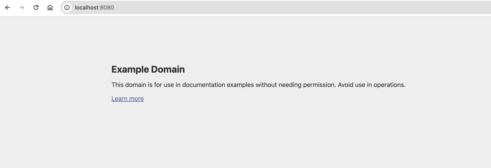

# Exercise 5.1 - DIY CRD & Controller

This project implements a Kubernetes Custom Resource Definition (CRD) called `DummySite` and a custom controller.

When a `DummySite` resource is created, the controller:

- Watches for new `DummySite` resources
- Reads the `website_url` field
- Creates a Deployment and a Service
- Downloads the target website
- Serves the downloaded content using Nginx

## Example

Create a DummySite resource:

```yaml
apiVersion: stable.dwk/v1
kind: DummySite
metadata:
  name: example-site
spec:
  website_url: https://example.com
```

Apply the resources:

```bash
kubectl apply -f crd.yaml
kubectl apply -f rbac.yaml
kubectl apply -f controller-deployment.yaml
kubectl apply -f dummysite.yaml
```

Verify:

```bash
kubectl get dummysites
kubectl get deployments
kubectl get services
```

The controller creates a Deployment and Service for `example-site`, and the resulting application serves a copy of the content from `https://example.com`.



## Technologies

- Kubernetes CRD
- Kubernetes JavaScript Client
- Node.js
- Docker
- Nginx

## Author

Rakhi Chandran chirayil