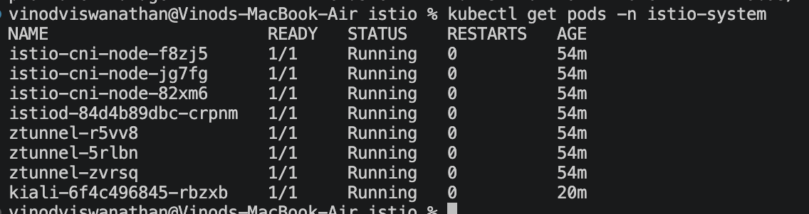
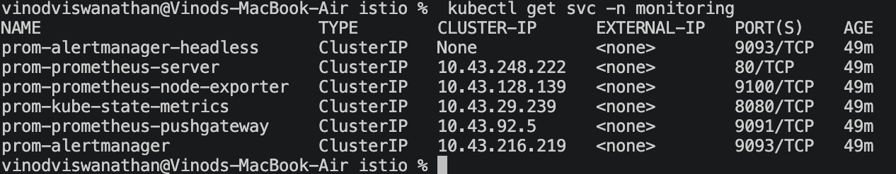
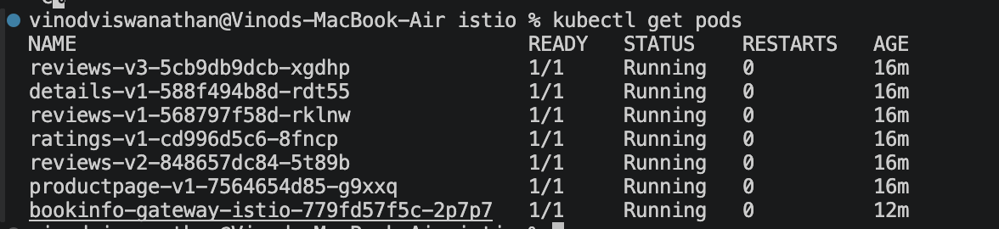
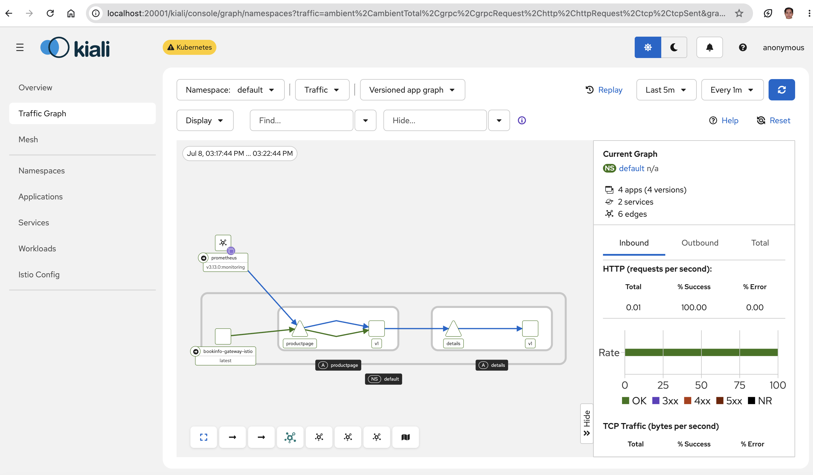

# Exercise 5.2

Installed Istio Ambient Mode on a k3d cluster.

Completed:
- Istio CLI installation
- Ambient mode installation
- Prometheus installation
- Kiali installation
- Bookinfo deployment
- Traffic verification in Kiali

Verified access to:
- Bookinfo application
- Kiali dashboard
- Service mesh traffic graph

