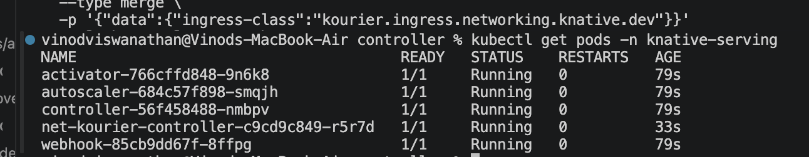
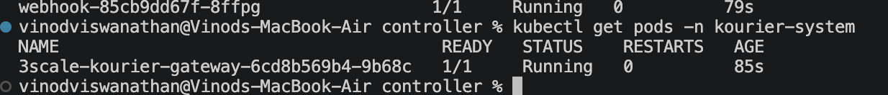
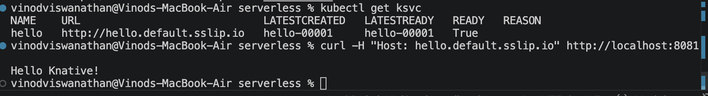
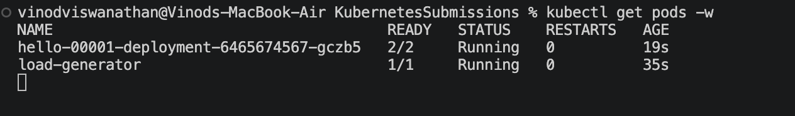
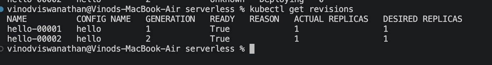
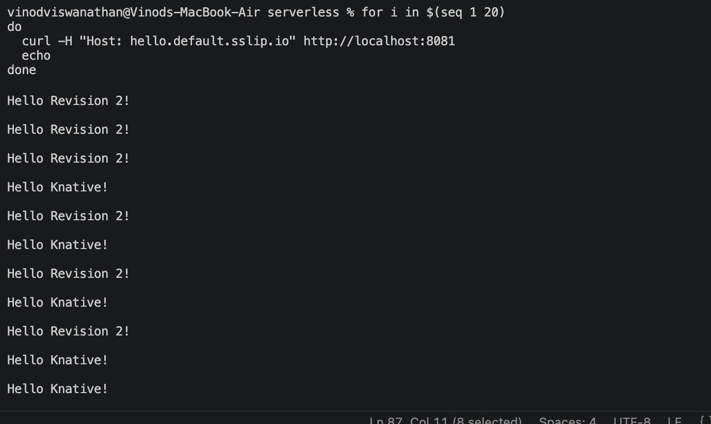

# Exercise 5.6 – Trying Serverless with Knative

## Environment

- k3d
- Kubernetes v1.34
- Knative Serving
- Kourier networking layer
- Magic DNS (sslip.io)

## Installation

Created cluster:

```bash
k3d cluster create \
  --port 8082:30080@agent:0 \
  -p 8081:80@loadbalancer \
  --agents 2 \
  --k3s-arg "--disable=traefik@server:0" \
  --image rancher/k3s:v1.34.1-k3s1
```

Installed:

- Knative Serving
- Kourier
- Magic DNS

## Verified Installation

```bash
kubectl get pods -n knative-serving
```


```bash
kubectl get pods -n kourier-system
```




All pods were in Running state.

## Deploying a Knative Service

Created and deployed the sample hello service.

Verified:

```bash
kubectl get ksvc
```

Accessed using:

```bash
curl -H "Host: hello.default.<IP>.sslip.io" http://localhost:8081
```

Received the expected response.



## Autoscaling

Generated traffic against the service and observed pod scaling behavior.

Verified:

```bash
kubectl get pods -w
```




Knative automatically scaled the service based on traffic.

## Traffic Splitting

Created a second revision and configured traffic splitting.

Verified using:

```bash
kubectl get revisions
```



and confirmed traffic distribution between revisions.



## Conclusion

Successfully installed Knative Serving and Kourier, deployed a serverless application, verified autoscaling, and configured traffic splitting.