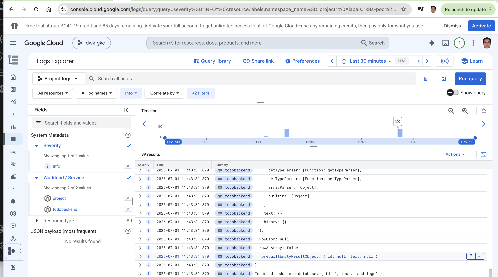

# second deployment to kubernetes
a sample nodejs application
execute the following command to deploy to kubernetes:
kubectl apply -f manifests/deployment.yaml
then run kubectl get pods to get pod name.
kubectl logs podname will give you the application logs.
to run the application execute the following command
# kubectl port-forward pod-name 8080:3000
now check in browser http://localhost:8080
# kubectl apply -f manifests/service.yaml
now in browser access the application using: http://localhost:8082/
# added ingress.yaml file
access the application in browser: http://localhost:8081/

# Exercise 3.9 - DBaaS vs DIY Database

## Option 1: DBaaS (Google Cloud SQL)

Cloud SQL is a fully managed PostgreSQL service provided by Google Cloud. Google manages backups, patching, updates, replication, and high availability. Cloud SQL also supports automated backups and point-in-time recovery.

### Pros

- Very little operational work is required.
- Automated backups and recovery features are built in.
- Automatic patching and maintenance.
- Easy high-availability and replication configuration.
- Built-in monitoring and security.
- Developers can focus on application development instead of database administration.

### Cons

- More expensive than running PostgreSQL inside Kubernetes for small projects.
- Less control over the underlying infrastructure.
- Increased vendor lock-in to Google Cloud.

### Initialization Effort

Low. A Cloud SQL instance can be created through the Google Cloud Console in a few minutes.

### Cost to Initialize
Moderate. A Cloud SQL instance starts generating costs immediately after creation. Additional costs may be incurred for:
- Storage
- Automated backups
- High availability configuration
- Network traffic

Although setup is simple, there is a financial cost even for small workloads.

### Maintenance

Low. Google manages upgrades, backups, failover, storage, and most operational tasks.

### Backup Strategy

Cloud SQL provides:

- Automated backups
- On-demand backups
- Point-in-time recovery (PITR)
- Backup retention policies

Backups and restores can be configured through the Cloud Console or the Cloud SQL API.

---

## Option 2: DIY PostgreSQL on GKE

In this approach PostgreSQL runs inside the Kubernetes cluster using a StatefulSet and PersistentVolumeClaims. Storage is backed by Google Persistent Disks.

### Pros

- Full control over PostgreSQL configuration.
- Potentially lower cost for small workloads.
- Database configuration can be managed entirely through Kubernetes manifests.
- Easier to keep everything inside the Kubernetes cluster.

### Cons

- More operational responsibility.
- Manual database upgrades.
- Manual backup and restore setup.
- High availability and replication require additional configuration.
- More complicated disaster recovery procedures.

### Initialization Effort

Medium to high. StatefulSets, Services, Secrets, PVCs, and storage configuration must be created and maintained.

### Cost to Initialize
Low to moderate. If a GKE cluster already exists, the main additional cost is the Persistent Disk used by the database. Initial infrastructure costs are usually lower than Cloud SQL.However, engineering time spent configuring and operating PostgreSQL should also be considered as part of the overall cost.

### Maintenance

High. The team is responsible for:

- PostgreSQL upgrades
- Backup scheduling
- Restore testing
- Monitoring
- Replication and failover configuration

### Backup Strategy

Backups must be implemented separately using tools such as:

- pg_dump
- CronJobs
- Velero
- Persistent Disk snapshots

Restore procedures must also be designed and tested by the development team.

---

## Conclusion
For a production environment, I would choose Google Cloud SQL because it significantly reduces operational overhead, provides managed backups, automated maintenance, and built-in recovery capabilities. It allows developers to focus on building and operating the application rather than managing the database infrastructure. 
For learning purposes and small projects, running PostgreSQL inside GKE using StatefulSets and PersistentVolumeClaims provides more control and helps in understanding Kubernetes storage concepts and database operations.

## Exercise 3.12 - GKE Monitoring and Logs

The screenshot below shows the application logs in Google Cloud Logging after creating a new todo item.

## Exercise 4.3 - Prometheus

Write a query that shows the number of pods created by StatefulSets in prometheus namespace. :

count(
  kube_pod_info{
    namespace="monitoring",
    created_by_kind="StatefulSet"
  }
)
